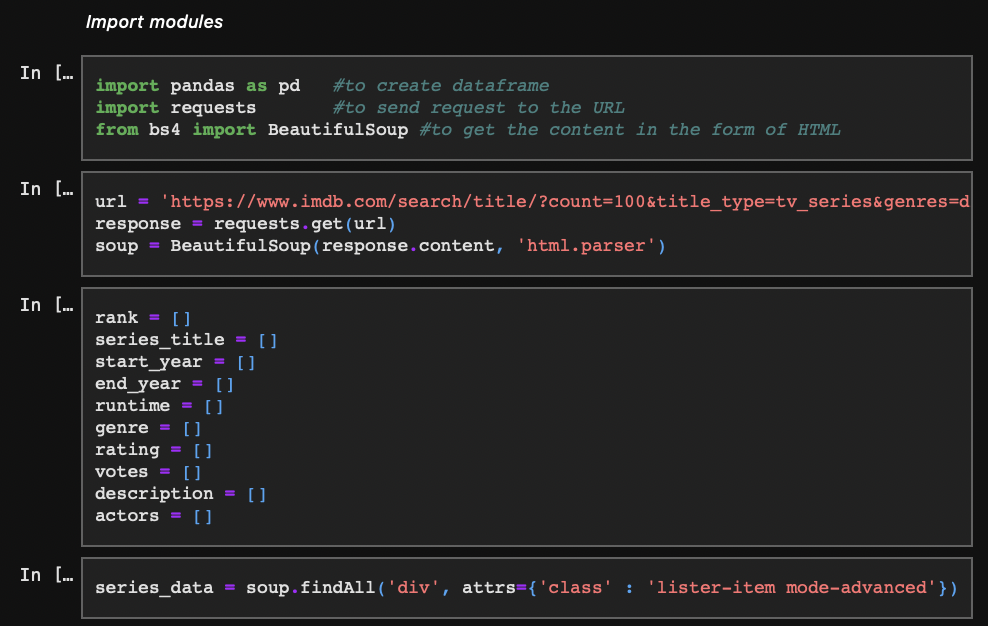

<h1 align="center">
  <br>
  Seleksi Warga Basdat 2023 : Scraping Top 100 TV Series IMDB
  <br>
  <br>
</h1>

# Data & DBMS Description 
Pada tugas seleksi Warga Basdat kali ini, saya memilih untuk melakukan data scraping pada website IMDB, terutama pada bagian Top 100 TV Series karena tidak bisa dipungkiri bahwa akhir-akhir ini, TV Series sangat populer dan diminati oleh banyak orang. Adapun data yang saya peroleh adalah ranking penilaian TV Series, Judul, Tahun dimulai dan selesai, durasi per episode, genre dari TV Series tersebut, rating yang diberikan oleh para pengguna IMDB, jumlah votes yang membentuk rating tersebut, deskripsi yang menceritakan garis besar dari TV Series tersebut, dan nama aktor utama yang ada pada TV Series tersebut.

# Spesifikasi Program
Pada proses data scraping, saya menggunakan Jupyter notebook dengan beberapa library, yaitu panda untuk membuat dataframe, requests untuk memastikan bahwa saya bisa mengirim request ke URL yang akan diakses, dan menggunakan beautifulSoup untuk melakukan pengambilan konten pada bentuk HTML untuk mendapatkan data yang diinginkan. Untuk membuat database dan melakukan penyimpanan data scraping, saya menggunakan python dengan library psycopg2 untuk membuka koneksi dengan  database postgreSQL yang digunakan. Pemindahan data scraping ke database postgreSQL dilakukan dengan mengakses file json yang dihasilkan dari data scraping, dan melakukan insert ke table yang telah dibuat. Alasan saya menggunakan postgreSQL sebagai DBMS adalah stabil, dan ia dapat memenuhi kebutuhan data yang harus mengikuti ACID, yang dapat memastikan integritas data.  

# How to Use
## Data Scraping
1. Install library yang akan digunakan
```
pip install bs4
pip install pandas
```
2. Buka Scraping.ipynb yang dapat diakses di
```
Data Scraping/src/Scraping.ipynb
```
3. Run seluruh kode, dan ubah filepath menjadi path yang diinginkan, file finaldata.json akan tersimpan di path yang telah dipilih

## Open SQL file
1. Download file sql di 
```
Data Storing/export/tvseries.sql
```
2. Buka terminal, run prompt berikut
 ```
psql -U your_username -d your_database -h your_host -p your_port
```
4. Setelah itu, masukkan command berikut
```
\i tv_series.sql
```
# Json Structure
```
{
    "Rank":"Rank di IMDB",
    "TV Series Title":"Judul",
    "Year Started":"Tahun dimulai",
    "Year Ended":"Tahun Selesai",
    "Duration":"Durasi dalam menit",
    "Genres":[ "Genre TV Series"],
    "Rating":"Rating dalam skala 10",
    "Votes":"Jumlah Votes",
    "Description":"Deskripsi",
    "Actors":["Nama Aktor"]
  }
```

Contoh salah satu record data
```
{
    "Rank":"1",
    "TV Series Title":"The Witcher",
    "Year Started":"2019",
    "Year Ended":"Present",
    "Duration":"60",
    "Genres":[
      "Action",
      " Adventure",
      " Drama"
    ],
    "Rating":"8.1",
    "Votes":"532,263",
    "Description":"Geralt of Rivia, a solitary monster hunter, struggles to find his place in a world where people often prove more wicked than beasts.",
    "Actors":[
      "Henry Cavill",
      " Freya Allan",
      " Anya Chalotra",
      " Eamon Farren"
    ]
  }
```
# Database Structure



# Translation Process

# Program Snippets


# Library
1. Beatuifulsoup
2. Pandas

```
by Farah Khairana Haniifah
18221139
```
